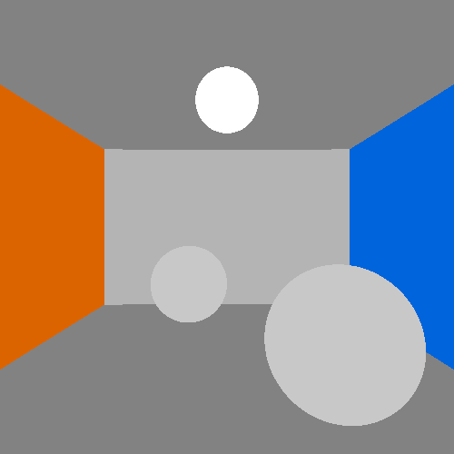
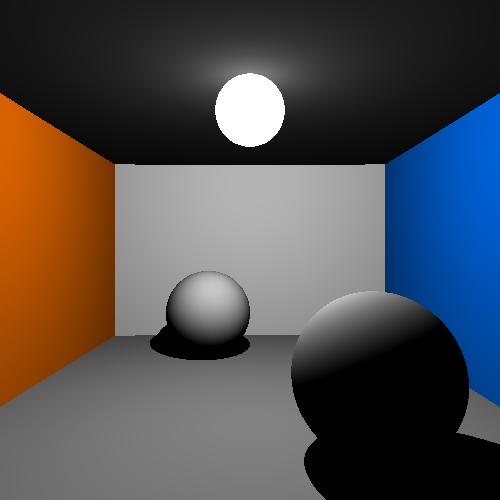

## About
Simple raytracer. First sequential implementation. Goal is experimenting with CUDA.

## Example images
Example images, tracking versions. These mimick the example at [wikipedia](https://de.wikipedia.org/wiki/Raytracing).

### Version 1: Only intersection test, no light, no recursive rays.

### Version 2: simple lighting, lambert shader, no recursive rays.

